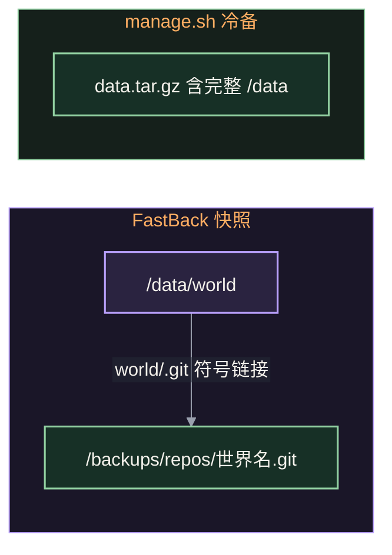

# FastBack 增量快照与恢复

默认 `vanilla-plus` 服务端包含 **FastBack 0.35.0+26.3.0**，用 Git 与 Git LFS 保存世界快照；客户端无需新增模组。[锁定发行版本](https://modrinth.com/mod/fastback/version/RvW6Ltl7)。Docker 镜像已包含 Git、Git LFS 和管理辅助脚本，直接运行服务端 ZIP 时需按下文完成首次初始化。

## 保存什么、放在哪里

| 方式 | 内容 | 默认位置 |
| --- | --- | --- |
| FastBack 快照 | 世界目录，含所有维度和玩家数据 | Docker 备份命名卷内的 `/backups/repos/<level-name>.git` |
| 直接运行服务端 ZIP 的快照 | 相同的 Git/LFS 世界快照 | 按下文初始化后，为服务端父级 `backups/repos/<level-name>.git` |
| `./manage.sh backup` | 停服冷备完整 `/data`，包括世界、配置、白名单、模组和运行缓存 | 部署目录 `backups/backup-<UTC时间>-<随机后缀>/data.tar.gz` |

首次快照仍需记录完整初始世界；后续增量保存变更文件的 Git/LFS 对象。它不会每次生成完整 ZIP，也不保证任意世界大小都能达到固定压缩比。大区域文件频繁变化时仍会增加存储用量。

Docker 中，`/data/world/.git` 是指向 `/backups/repos/world.git` 的符号链接；自定义世界名按 `server.properties` 的 `level-name` 对应。Git 对象与 LFS 对象都保存在独立挂载的备份目录。**复制或迁移备份时保存整个 `repos/`，不要拆开仓库，也不要只复制 `config`、`refs` 或个别对象目录。**

FastBack 只快照世界，不包含 `server.properties`、白名单、管理员名单、服务端 `mods/` 或 `config/`。`manage.sh backup` 的完整 `/data` 冷备会保留世界中的链接，但**不包含链接外部的 Git/LFS 历史**；完整迁移还需单独保存备份命名卷。升级前保留完整冷备，并定期把快照仓库复制到其他磁盘或远端存储。



## Docker 首次安装与升级

Compose 保持单个 `minecraft` 服务，将 `MC_BACKUP_VOLUME` 命名卷挂到容器 `/backups`，默认名为 `minecraft-vanilla-stack-backups`。Docker 自动创建并从镜像目录初始化卷权限，无需首次 `mkdir` 或 `chown`。游戏容器以 `10001:10001` 运行。

明确接受 EULA 后，运行时才初始化外部 Git 仓库与默认策略，保留已有世界。重复启动不重置 Git 配置。升级前确认 `docker compose config` 同时包含 `/data` 和 `/backups` 两个持久卷；备份卷更名不会迁移已有历史。其他 YAML 包若不含 FastBack，运行时不会调用此初始化，也不要求备份挂载。

初始化还会把已经验证的仓库目标精确加入服务端根目录的 `allowed_symlinks.txt`，让 Minecraft 26.3 允许世界中的外置 `.git` 链接；保留原有自定义规则。旧实例已初始化但缺少这条规则时，更新后的辅助脚本会补齐。不要添加 `[regex].*` 这类全放行规则。

已有未知 `.git`、备份目录丢失或仓库混用时会拒绝自动初始化；不会把来源不明的仓库自动迁移到新位置。出现拒绝提示时保留原世界与备份目录，先核对归属和路径，不要删除 `.git` 来绕过检查。

新模板设有 `pause-when-empty-seconds=0`，让无人在线时继续执行原版自动保存与快照调度。已有 `server.properties` 不覆盖，升级时须停服后手动添加或修改这一行，再重启。Compose 正常停服等待设为 **10 分钟**，给保存与关服快照留出时间；手动缩短等待可能中断大世界快照。

## 默认策略与管理员操作

默认策略在仓库首次初始化时写入 Git 配置，已有个人设置保留：

| 项目 | 默认行为 |
| --- | --- |
| 周期 | 每 60 分钟到期，在随后一次原版自动保存时触发 |
| 定时动作 | `full-gc`，创建快照并执行保留清理与垃圾回收 |
| 关服动作 | `local`，正常关服时创建本地快照 |
| 保留数量 | 固定数量策略设为 24 个快照；上游实际保留最新 23 个加最早 1 个 |
| 远端 | 未配置远端；`full-gc` 提示跳过远端后仍继续本地清理与垃圾回收 |

不设置磁盘容量阈值或硬配额。删除快照引用不等于立即释放全部 Git/LFS 对象；需要观察仓库实际占用并保留足够空闲空间。保存、首次快照和垃圾回收可能占用时间，不能保证零卡顿。目录或快照名称存在也不等于备份可恢复，应检查日志并实际导出验证。

管理员可在游戏内使用 `/backup local` 创建本地快照，使用 `/backup list` 查看快照、`/backup info` 查看状态。服务端控制台不加 `/`：

```text
backup local
backup list
backup info
```

上游 `/backup restore` 会导出到新目录，不改动当前世界，但导出物包含 Git 元数据。本项目辅助脚本校验 Git/LFS 对象，导出不含 `.git` 的世界数据，并保留恢复所需的 world-id；本文使用这条流程。首次部署应确认一次手动快照、一次无人在线的定时快照及一次正常关服快照；本文不代表这些游戏内步骤已完成实测。

## 导出 Docker 快照

以下命令在部署目录运行；使用过 Compose 覆盖文件时继续带上原来的 `-f` 参数。先正常停服，再让一次性容器调用辅助脚本；`--entrypoint python3` 不会启动 Minecraft：

```sh
docker compose stop minecraft
docker compose logs --tail 80 minecraft
docker compose run --rm --no-deps --entrypoint python3 minecraft \
  /opt/mvs/server/fastback.py list --backup-dir /backups --world world
```

从列表选择真实快照名，替换下方示例：

```sh
docker compose run --rm --no-deps --entrypoint python3 minecraft \
  /opt/mvs/server/fastback.py export --backup-dir /backups --world world \
  --snapshot 'AbCD/2026-10-06_12-00-00'
```

默认导出到容器 `/backups/restores/world/<时间戳>`，保存在独立备份命名卷内，可从停止的游戏容器用 `docker cp` 复制到宿主，具体路径以输出为准。也可传 `--target /新的空目录`；该目录需在可写挂载内才能保存在宿主。脚本只读快照仓库，校验 Git blob 与实际 LFS 对象，拒绝非空目标，不会改动当前世界。

**导出目录直接包含 `level.dat`、`region/` 等世界内容，没有 `.git`。** 将它作为新的世界目录使用，不要套成 `world/world`。恢复新数据卷时另行复制服务端配置和白名单，不复制旧 `.mvs` 运行记录或 `allowed_symlinks.txt`；`--attach-existing` 会为已验证的当前仓库目标生成允许规则。FastBack 历史需按恢复流程显式连接，不能仅复制世界后直接启动。Docker 的完整步骤见 [Docker 指南](https://cnb.cool/Mintimate/tool-forge/minecraft-vanilla-stack/-/blob/main/docs/docker.md#恢复-fastback-快照)。

## 直接运行服务端 ZIP

先安装可执行的 Git 与 Git LFS，并检查：

```sh
git --version
git lfs version
```

推荐首次安装时准备 **Python 3.10+**，在已解压的服务端目录执行辅助脚本，建立同样的外置备份布局。先阅读并自行同意 EULA，再将 `eula.txt` 改为 `eula=true`：

```sh
mkdir -p ../backups
python3 fastback.py init --data-dir . --backup-dir ../backups --world world
```

Windows 先创建服务端父级的 `backups` 目录，再用 `py -3 fastback.py init --data-dir . --backup-dir ..\backups --world world`；创建符号链接需要相应权限或开发者模式，不能保证每台 Windows 电脑都能直接完成。`world` 应与 `server.properties` 的 `level-name` 相同。初始化不会替换已有世界；未知 `.git` 或来源不匹配的外部仓库会被拒绝。

完成初始化后，Linux/macOS 用 `sh start.sh`、Windows 用 `start.bat` 启动。Python 用于此辅助脚本的初始化、列举与导出，日常游戏启动仍使用 Java；Git 和 Git LFS 必须持续可用。上游游戏内 `/backup init` 可建立内置于世界目录的仓库，但不具有本文的独立宿主备份布局。

停服后可在服务端目录导出快照：

```sh
python3 fastback.py list --backup-dir ../backups --world world
python3 fastback.py export --backup-dir ../backups --world world \
  --snapshot 'AbCD/2026-10-06_12-00-00'
```

导出目录直接包含 `level.dat` 与 `.fastback/world-id`，没有 `.git`。需要恢复时，保持原服停止，在独立的新服务端目录准备备份对应版本的包及原服配置、白名单，将导出内容整体放入新目录中的 `world/`（不要形成 `world/world`，也不要复制旧 `.mvs`）。然后显式接回原来的外置历史：

```sh
python3 fastback.py init --data-dir /新的服务端目录 \
  --backup-dir /原来的完整备份目录 --world world --attach-existing
```

这里的 `--backup-dir` 应包含原 `repos/world.git`。脚本会核对 world-id 与仓库身份，再建立链接并为当前目标补齐 `allowed_symlinks.txt`；不要从旧目录复制这个规则文件。不匹配时停止，不要删库或改 world-id 规避。接回成功后才启动新目录，原服不能同时运行。检查 `level.dat`、所有维度与玩家数据，创建并导出一次新快照；原世界、完整快照仓库及原始配置保留到验证完成。若服务端配置已丢失，仅靠世界快照不能恢复白名单或其他运行设置。
