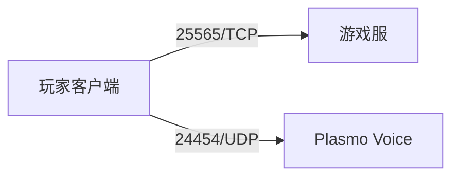

# 附近玩家语音

**`vanilla-plus` 0.1.0** 的客户端与服务端均使用固定的 **Plasmo Voice `fabric-26.3-2.1.17`**，用于附近玩家交谈；`minimal` 不安装语音模组，也不需要语音端口。客户端与服务端应使用匹配的预设和版本，具体文件以 `packs/vanilla-plus.yaml` 和包内清单为准。

## 玩家设置

1. 进入已安装相同版本 Plasmo Voice 的服务器，按 `V` 打开语音菜单。
2. 在 `Devices / 设备` 页选择麦克风与输出设备，并测试收音。[官方项目说明](https://github.com/plasmoapp/plasmo-voice)
3. 在 `Activation / 激活` 页检查 `Proximity / 附近语音`，使用“按住说话 / Push-to-Talk”。默认左 Alt（Mac 为左 Option），也可换成方便且不冲突的按键；个人设备与键位不会由本包强制重置。[官方激活模式](https://plasmovoice.com/docs/new-in-2xx/)
4. 两位玩家靠近测试，再逐步拉远。预设默认交谈范围 **48 格**，可选择 8、16 或 32 格，距离越远声音越弱。预设没有远程群聊或全服广播扩展。

Windows 在“设置 → 隐私和安全性 → 麦克风”允许桌面应用访问。macOS 在“系统设置 → 隐私与安全性 → 麦克风”允许对应启动器访问；官方启动器或 HMCL 无法请求权限时，可按 [模组官方麦克风排错](https://plasmovoice.com/docs/client/microphone-not-available/) 使用支持授权的启动器。

当前 JAR 包含 Windows x64、macOS Intel／Apple Silicon 音频原生库，未包含 Windows ARM64 原生库；Windows ARM64 语音兼容性需另行验证。能启动游戏不代表麦克风授权和音频功能已经正常。

## 服务端与网络

配置位置为 `config/plasmovoice/server/config.toml`；Docker 内是 `/data/config/plasmovoice/server/config.toml`，源码构建产物在 `build/vanilla-plus/server/`。预设内容：

```toml
[host]
ip = "0.0.0.0"
port = 24454

[voice]
client_mod_required = false
max_extra_audio_broadcast_distance = 0

[voice.proximity]
distances = [8, 16, 32, 48]
default_distance = 48
```

游戏连接使用 **25565/TCP**，语音另使用 **24454/UDP**。`vanilla-plus` Compose 已包含 `24454:24454/udp`；宿主机防火墙、云安全组与路由器 NAT 也需要放行／转发 UDP。仅支持 TCP 的隧道不能承载语音。[官方服务端安装](https://plasmovoice.com/docs/server/installing/)



缺少客户端语音模组的玩家仍可游玩，但不能发送或收听语音。已有服务端语音配置会保留；修改前正常停服，修改后重启。ZIP 部署同样需要开放 UDP。

公网语音端口需要使用 `30000/UDP` 而容器保持 `24454/UDP` 时：

1. 将映射改为 `"30000:24454/udp"`，重新创建容器。
2. 保持 `[host] port = 24454`，在配置中添加玩家可达的入口：

   ```toml
   [host.public]
   ip = "203.0.113.10"
   port = 30000
   ```

3. 将示例 IP 替换为实际公开入口，同步防火墙／NAT 的 `30000/UDP` 并重启服务端。

`MC_PORT` 只控制游戏 TCP。默认未指定公开语音地址时，玩家复用游戏连接主机；Docker 的监听地址通常保持 `0.0.0.0`。[官方监听与公开地址说明](https://plasmovoice.com/docs/server/advanced/)

## 排错与验收

- `Not installed`：确认两端确实加载了匹配的 Plasmo Voice；这与 UDP 不通不同。[官方排错](https://plasmovoice.com/docs/server/not-installed/)
- `Connecting / Can't connect`：检查语音服务、UDP 映射、防火墙、安全组与 NAT，游戏 TCP 连通不证明 UDP 可达。
- 已连接却听不到：检查输入／输出设备、音量、静音与激活按键，测试麦克风并让两位玩家站近。
- 距离很远仍听到：检查服务端已有距离设置，以及另装的群聊／广播扩展。

游戏内 `/vlist` 查看语音模组玩家，`/vreconnect` 重连；服务端控制台使用 `vlist`。列表识别成功不能替代双向通话测试。[官方命令](https://plasmovoice.com/docs/server/commands/)

上线前使用两台客户端验证双向收音、距离衰减、范围外静音与系统麦克风权限，再从外网测试 UDP，重启确认配置保留。静态构建与依赖校验不能代替实际音频验收。
